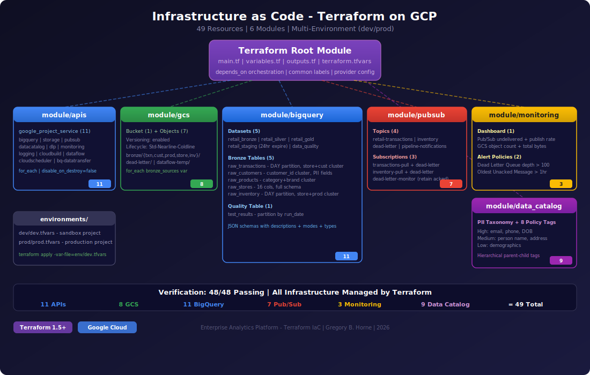

# Lab 02: Infrastructure as Code — Terraform on GCP

> Deploy an enterprise analytics platform with a single command: `terraform apply`


## Architecture



## Overview

This project codifies the [Enterprise Analytics Platform](https://github.com/gbhorne/enterprise-analytics) (Lab 01) as **Infrastructure as Code** using Terraform. Every GCP resource — from API enablement to PII policy tags — is defined in modular, reusable Terraform configurations.

The platform provisions a complete **medallion architecture** data warehouse with streaming infrastructure, monitoring, and data governance in ~3 minutes from a single `terraform apply`.

### What Terraform Manages (49 Resources)

| Module | Resources | Count |
|--------|-----------|-------|
| **apis** | GCP service enablement (BigQuery, Storage, Pub/Sub, etc.) | 11 |
| **gcs** | Data lake bucket + versioning + lifecycle + bronze folders | 8 |
| **bigquery** | 5 datasets + 6 tables with schemas, partitioning, clustering | 11 |
| **pubsub** | 4 topics + 3 subscriptions + dead-letter routing | 7 |
| **monitoring** | Dashboard (4 panels) + 2 alert policies | 3 |
| **data_catalog** | PII taxonomy + 8 hierarchical policy tags | 9 |
| **Total** | | **49** |

## Project Structure
```
lab02-terraform/
├── main.tf                          # Root module — orchestrates all modules
├── variables.tf                     # Input variables with defaults
├── outputs.tf                       # Output values
├── terraform.tfvars                 # Default variable values
├── modules/
│   ├── apis/main.tf                 # Enable 11 GCP APIs
│   ├── gcs/main.tf                  # Bucket + lifecycle + folder structure
│   ├── bigquery/main.tf             # Datasets + tables (full schemas)
│   ├── pubsub/main.tf               # Topics + subscriptions + dead letter
│   ├── monitoring/main.tf           # Dashboard + alert policies
│   └── data_catalog/main.tf         # PII taxonomy + policy tags
├── environments/
│   ├── dev/dev.tfvars               # Dev environment config
│   └── prod/prod.tfvars             # Prod environment config
└── docs/
    ├── architecture_diagram.svg     # Visual architecture diagram
    ├── VERIFICATION_REPORT.txt      # 48/48 verification output
    └── ARCHITECTURE_DECISIONS.md    # Technical decision records
```

## Quick Start
```bash
# Clone and configure
git clone https://github.com/gbhorne/terraform-gcp-analytics.git
cd terraform-gcp-analytics

# Update terraform.tfvars with your project
vim terraform.tfvars

# Deploy entire platform
terraform init
terraform plan -out=tfplan
terraform apply "tfplan"

# Destroy when done
terraform destroy -auto-approve
```

### Multi-Environment Deployment
```bash
# Deploy to dev
terraform apply -var-file=environments/dev/dev.tfvars

# Deploy to prod
terraform apply -var-file=environments/prod/prod.tfvars
```

## Verification: 48/48 Checks Passing
```
╔══════════════════════════════════════════════════════════════╗
║  ✅ Passed:  48    ❌ Failed:  0    Total: 48               ║
╠══════════════════════════════════════════════════════════════╣
║  INFRASTRUCTURE MANAGED BY TERRAFORM:                        ║
║  APIs             11 GCP services enabled                    ║
║  Cloud Storage    1 bucket, versioned, lifecycle policies    ║
║  BigQuery         5 datasets, 6 tables (schemas defined)    ║
║  Pub/Sub          4 topics, 3 subscriptions, dead-letter    ║
║  Monitoring       1 dashboard, 2 alert policies             ║
║  Data Catalog     1 taxonomy, 8 PII policy tags             ║
╚══════════════════════════════════════════════════════════════╝
```

## Key Technical Decisions

| Decision | Rationale |
|----------|-----------|
| 6 modular modules | Separation of concerns, reusable across projects |
| `for_each` over `count` | Stable resource keys — no index shifting on changes |
| `depends_on` for ordering | APIs enabled before any resource creation |
| `disable_on_destroy = false` | Prevents cascading failures during destroy |
| JSON schemas in BigQuery | Full field descriptions, modes, types documented |
| Environment-specific tfvars | Same modules deploy to dev/staging/prod |
| Common labels via locals | Consistent cost tracking across all resources |
| Dead letter policy | Failed messages routed for debugging, not lost |
| GCS lifecycle policies | Auto cost optimization — cold data to cheaper tiers |
| PII taxonomy hierarchy | Column-level security ready without IAM changes |

## Module Details

### apis
Enables 11 GCP services using `for_each`. Uses `disable_on_destroy = false` to prevent accidental service disruption.

### gcs
Data lake bucket with versioning, lifecycle policies (Standard -> Nearline at 365d -> Coldline at 730d), bronze folder structure via `for_each`, and operational folders (dead-letter, dataflow-temp).

### bigquery
Medallion architecture: 5 datasets (bronze, silver, gold, staging with 24hr auto-expire, data_quality). 5 bronze tables with full JSON schemas including field descriptions, partitioning (DAY), and clustering. 1 data quality table partitioned by run_date.

### pubsub
4 topics with configurable message retention via variable map. 3 subscriptions with dead-letter routing (max 5 delivery attempts). Names prefixed with environment (dev-, prod-).

### monitoring
Dashboard with 4 panels (Pub/Sub metrics, GCS metrics). Alert policies: Dead Letter Queue depth > 100, Oldest Unacked Message > 1 hour.

### data_catalog
PII taxonomy with fine-grained access control. 3-tier hierarchy: High Sensitivity (email, phone, DOB), Medium (name, address), Low (demographics). Ready for column-level security binding.

## Related

- **Lab 01:** [Enterprise Analytics Platform](https://github.com/gbhorne/enterprise-analytics) — The manually-built version this IaC codifies

## Disclaimer

This project was built as a portfolio lab exercise for educational and demonstration purposes. It is not intended for production use without further hardening, security review, and compliance validation.

## Author

**Gregory B. Horne**
